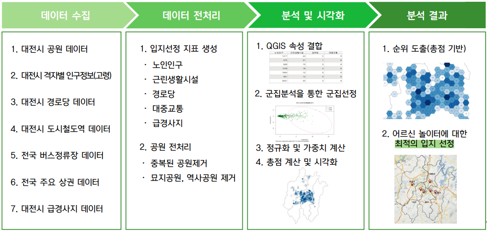
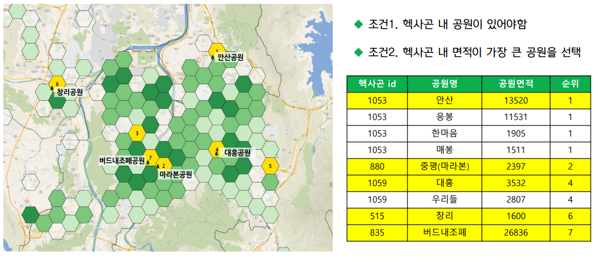
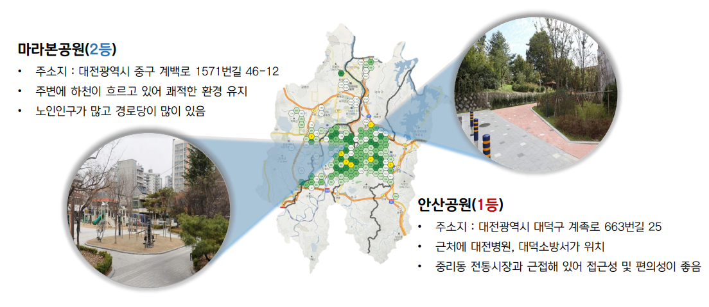

> ## 대전광역시 어르신 놀이터 최적 입지 선정
> 1. 이 프로젝트의 코드는 본인이 직접 코드를 개발한 것이 아니고, 팀원이 작업한 코드임을 밝힘.  
>    팀원들이 어떤 방향으로 코딩해서 전처리하고, 진행했는지 본인이 얼마나 이해했는지 업로드한 것.  
> 2. 공공 데이터포털 사이트에서 공유하고 있는 데이터와 현장방문, 인터뷰를 통해 데이터를 종합하여 수집함.  
 

> ### :heavy_check_mark: 분석 목적 및 방향
> 1. 대전광역시 내 어르신 놀이터 최적 입지 선정을 통한 고령화 시대의 사회 문제 해결  
 

> ### :heavy_check_mark: 주제 선정 이유  
> 1. 21세기 초고령화시대로 접어들면서 노인의 건강과 삶의 질에 대한 욕구 증대  
> 2. 증가하는 고령인구의 새로운 대안이 될 수 있는 어르신 놀이터  
> 3. 다양한 놀이를 포함한 여가생활을 위한 노인의 눈높이 맞춤 시설 확충  
 

> ### :heavy_check_mark: 분석 목표  
> 1. 입지 분석을 위한 요인들을 지수화하고, 가중치를 매겨 합산을 통한 분석결과를 종합하여 격자별 최적 입지 선정  
> → Python 언어와 R 언어를 적절히 조합, Python에서는 주로 전처리를 진행하고 R언어에서는 군집분석을 실시
> → 군집분석을 사용한 이유 : 1845개의 헥사곤(범위)을 유사한 성격을 갖는 군집으로 집단화하고 형성된 군집들의 특성을 파악하기 위함
 

> ### :heavy_check_mark: 분석 방법
   
   
> 1. 데이터 수집 : 데이터 공공 포털 사이트에서 대전광역시 자료 수집, 공주 어르신 놀이터 설립자 인터뷰 진행 등으로 수집
> 2. 전처리 : 정규식을 활용하여 중복데이터, 불필요한 데이터 제거 및 통합
> 3. 분석 : 상관분석, GIS 헥사곤 밀도 분석, 군집 분석 
 

> ### :heavy_check_mark: 의사소통 방법  
> 1. 비대면으로 진행 시, Zoom 온라인 회의를 통해 각자 역할을 분담하여 작업 실시  
> 2. 대면으로 진행 시, 프로젝트 시작하기 앞서 각자 맡아서 해야할 일에 대한 역할을 정한 후 진행
 

> ### :heavy_check_mark: 결과물  
   
> 1. QGIS 프로그램을 통하여 지도를 시각화
> 2. 상위 5%에 해당되는 헥사곤(범위) 출력
> 3. 선택된 헥사곤(범위) 내에 공원이 여러 개가 존재한다면 가장 넓은 공원을 선택
 

> ### :heavy_check_mark: 한계점  
> 1. 대전시 경사도 데이터의 부재
>    현재 급경사지 데이터는 포인트 좌표로만 나타나있어 해당 지역의 정확한 경사도를 파악한다면, __더 명목화된 지표__ 로 활용 가능
> 2. 어르신 놀이터 데이터의 부재
>    국내 어르신 놀이터의 설치 사례가 거의 없음
> 3. 공원 이용 현황 데이터의 부재
>    각 공원의 이용 현황 데이터가 없음  
 

> ### :heavy_check_mark: 기대효과  
> 1. '어르신 놀이터'라는 문화공간을 제공함으로써 사람들과 능동적 상호교류 기회를 확대 할 수 있음  
> 2. 선정된 어르신 놀이터에 젊은 세대와 함께하는 다양한 교육 프로그램을 기획하여 세대 간 교류를 활성화 할 수 있음  
 

> ### :heavy_check_mark: 데이터 전처리 및 작업한 것에 대한 느낀점
> 1. 의사소통능력이 정말 중요하다. 
     팀 단위로 이루는 업무에서는 당연한 이야기지만, 상황에 따라 대처하는 능력과 팀원의 흐름을 파악할 수 있어야한다.
> 2. 프로젝트의 방향을 확실히 정해야한다.
     여러 사람의 의견이 엇갈리는 만큼, 최대한 의견을 수용하지만 프로젝트의 방향을 잃지 않아야한다.
> 3. 통계에 대한 지식이 필요하다.
     경험의 감으로 통계를 수치화하는 것이 아니라 논리정연하게 근거있는 자료를 제시해야할 필요가 있다.

 
